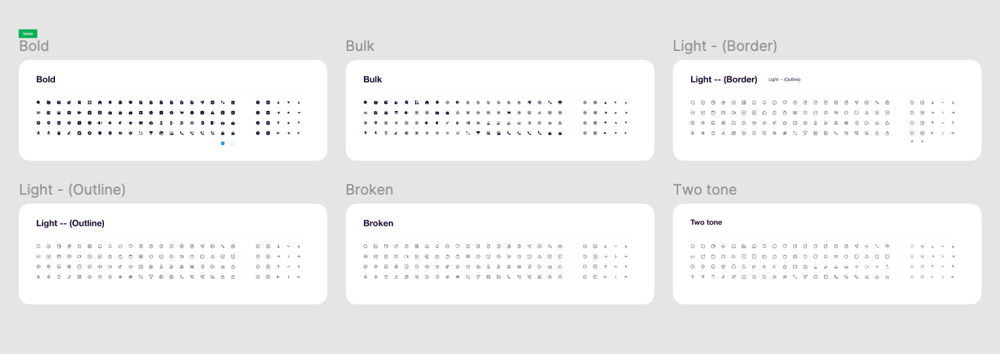
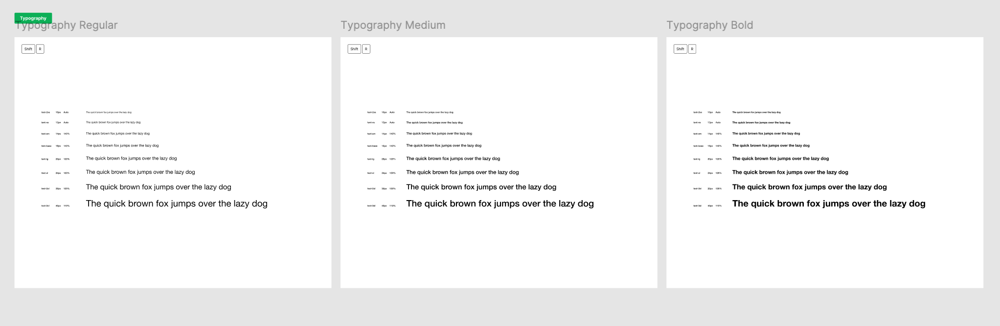
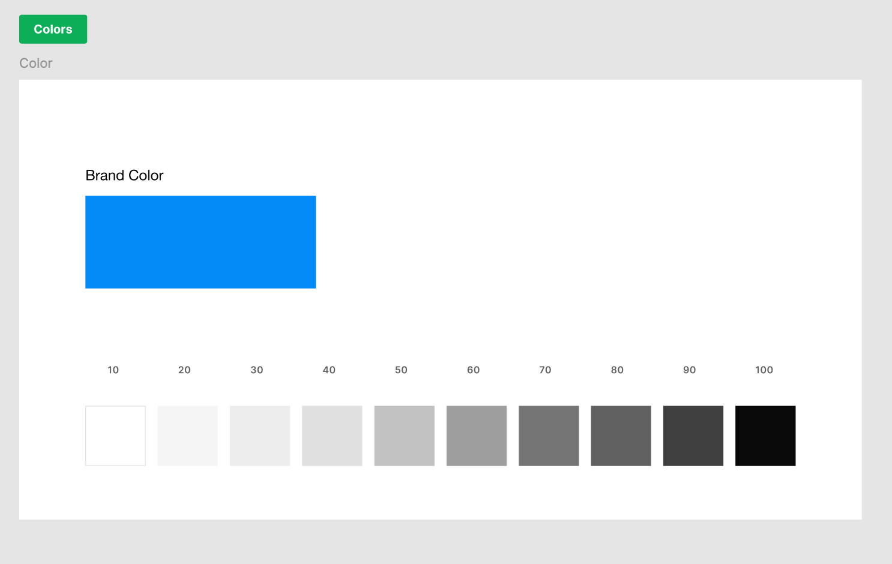
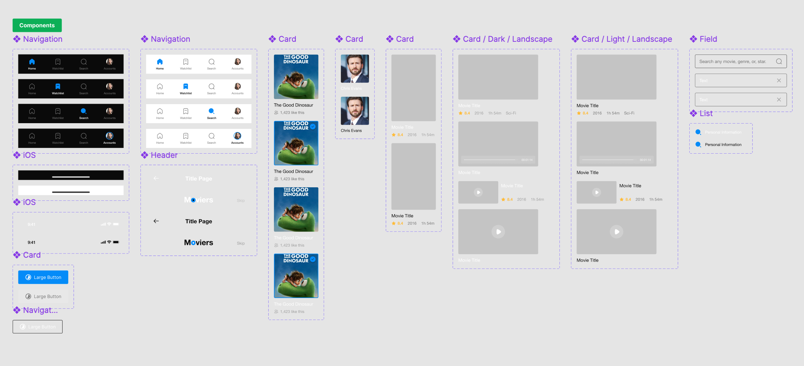
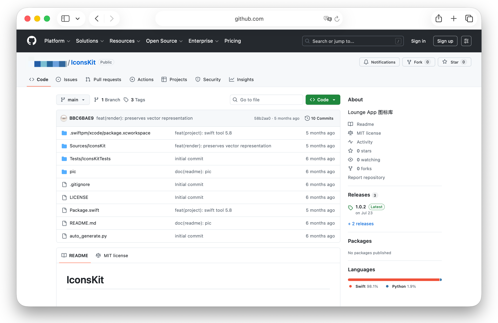
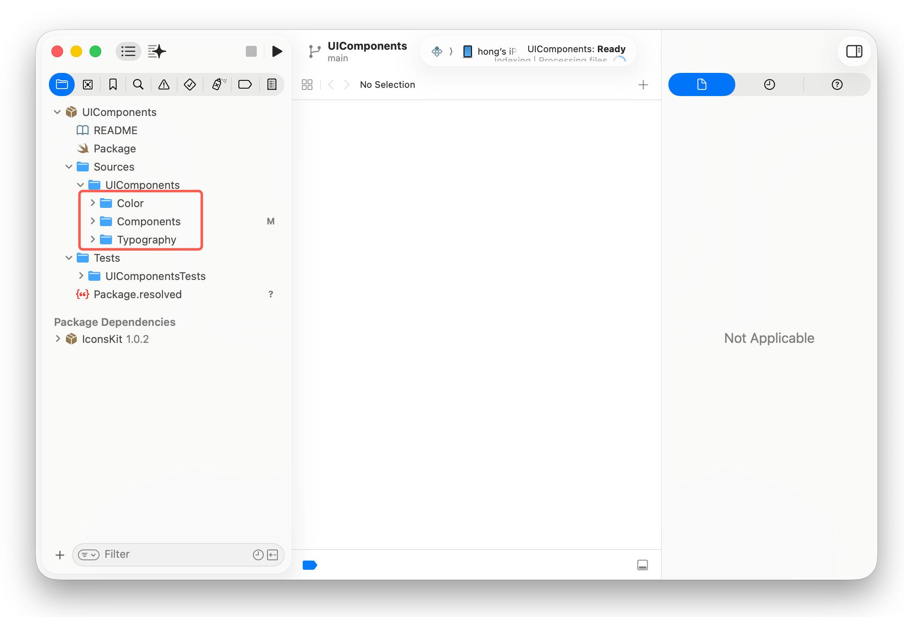
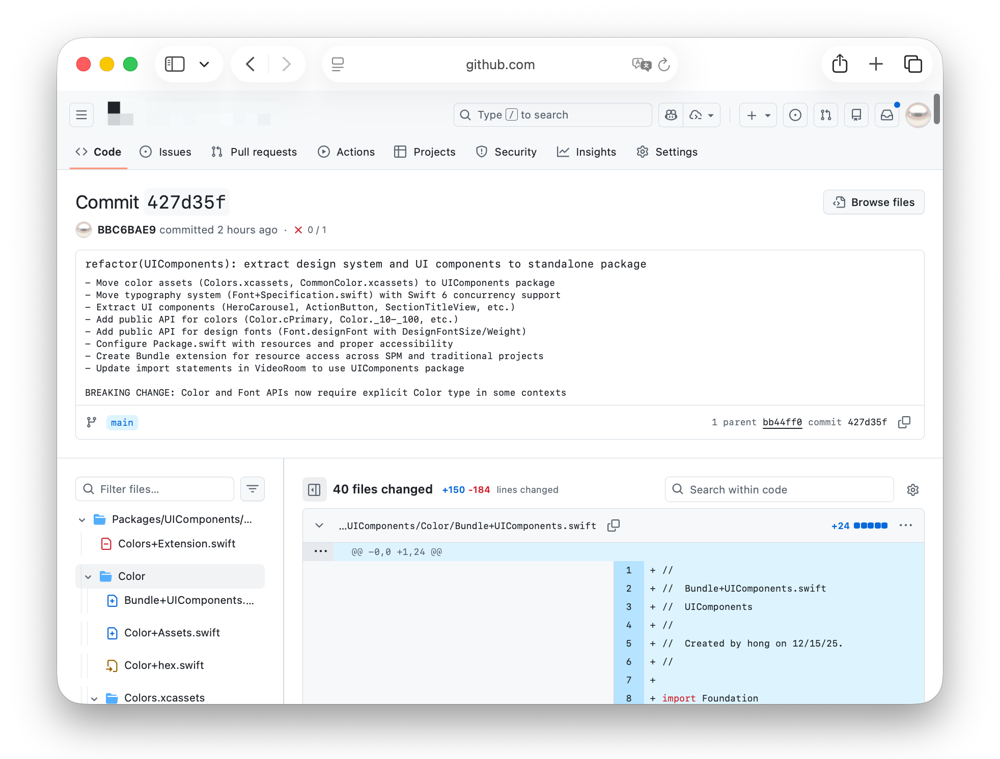

# 花了1W块钱，AI会把我的代码写成什么样子？

## 1、我怎么给AI做工程化的

### 1.1、一个标准的设计稿

一个好的设计稿是一个两个工程的重要开端。设计系统的混乱，会造成整个软件系统的混乱很多年。一个项目一般就是50种卡片以内，不规范的业务的卡片库，能出现1000种样式定义。

它主要包含以下部分

（1）icon库



（2）字体库



（3）颜色库



（4）基础组件库



### 1.2、一个标准的UI代码组件库

有了一个质量很好的设计稿，接下来要做的就是拥有一个1:1复刻的高质量代码组件库，他的定位类似TDesign、Taiwind，它定义了程序的整个视觉风格。但是与业务无关。相应的它包含

（1）icon库



（2）字体库

（3）基础组件库



### 1.4、带有业务含义的组件封装

比如一个瀑布流页面，我们最后的目标是，用一行代码，完成一个页面的开发

```swift
GridPage(api:"https://wwww.tencent.com/home_list", params: params)
```

这个页面包含了

a、刷新页面

b、加载更多

c、卡片查找

d、边距、行间距、列间距

e、no more data


### 1.5、业务组件划分

这个步骤是为了业务间可以彻底解耦，解耦就是解耦。

带有桥操作、带有注入逻辑的。别狡辩了，你设计有问题。


### 1.6、一个支持简单路由的路由系统

这个步骤是为了业务内的不同页面可以解耦合，如果我在日常开发中看到谁在路由系统里传入了复杂参数，是非常常见也非常灾难的做法。我对这种做法持有很坏的评价


这里我们暂停一下，为什么我们要做这个标准化？因为我想为AI屏蔽一些实现细节，来让我举几个简单的例子

还是用一个瀑布流来举例

【情景1】

使用过程：AI发现当前是瀑布流业务，最智障的AI也会用最少的token，找到GridPage组件，通过一行代码完成调用

结果：通过

【情景2】

AI发现当前是瀑布流业务，他写了网络请求，解析了数据，判断了是不是有更多的数据，查了设计稿，自己设置了边距，然后从头画了一个卡片。

结果：代码出现编译错误、边距错误、分页逻辑写错了，写了一个新卡片，浪费了很多token，下次还要从头再写一次


软件工程的本质就是对抗熵增的过程，如果你已经做到高度的工程化，那么你已经帮AI大大增加了信息的确定性&准确性。如果一个设计稿中的按钮标注的是"q093u9wehdcxiuabsxaoe"，那AI要花多少token才能辨认"q093u9wehdcxiuabsxaoe"对应项目中的`ConfirmButton`呢?


## 1.7、 mdc的使用

这个最朴素的工具，在实战的过程中应用过多。在这里我分享几个我常用的mdc

（1）`network.mdc` 我要求项目使用更现代的Concurrency + 范型来编写通用网络请求。并且注重网络请求组的并发的编写

（2）`mvvm.mdc` 我要求我的项目使用mvvm的设计模式

（3）`page.mdc` 我要求我的页面完全解偶遇项目，且可独立Preview，并规定了标准的写法

（4）`ui.mdc` 我要求项目是使用标准的UI组件库进行开发

（5）`git.mdc` 我要求我的项目使用Angular的规范来进行提交。以便日后我可以自动化的获得我项目的所有更新日志



## 2、我是怎么在AI上花出去这个钱的

### 2.1、Cursor

我的订阅费是200美金/月，我真的太喜欢使用cursor了


### 2.2、Github Copilot

Github Copilot有两个主要的作用

（1）帮我完成**云端开发**，我在issue里面提出我具体的需求，Copilot帮我完成代码的开发，Pull Request的创建。10分钟后Github会发来通知，让我完成这个CR的Review


（2）帮我完成在手机上完成开发。地铁里、睡觉前，任何空隙时间，我想到了一个产品创意，我都会用手机输入我的想法到项目的issue，配合Github Action的自动部署系统，我可以很快看到我的想法变成现实。


（3）使用VSCode+Copilot，作为Cursor的补充


### 2.3、技巧分享

（1）交叉验证。我通常会用cursor写需求，Github Copilot & Codebuddy进行Code Review，最后再用Github Copilot & Codebuddy Code Review的文档输入给cursor

```sh
“分析下这两份code review有道理么？有道理的话改了”
```

天呐，我真的好久没有亲自动手写代码了！

（2）简单任务用Agent，复杂任务使用Plan。结合使用。

（3）还有一点我想强调的是。你的代码本身质量越高，AI用起来就更顺手

```swift
Class Add {
    var ret:Int = 0

    func addOne(){
        ret += 1;
    }
    
    func addTwo(){
        ret += 2;
    }
}

let add = Add()

add.addOne()
add.addTwo()

let ret = add.ret
```

也许你会觉得上面的代码非常智障，但是先不着急骂，好多人的网络请求模块就是这么写的哦。（手动比心）

人和AI一样都有注意力，越内聚、越单元化。正确性和处理速度越快。有的项目的代码，不改则已，一改就出Bug，这并不是不仔细。谁改都容易错，错与不错都是概率问题。


## 3、不要迷信概念

`spec`、`skills` 这些概念层出不穷。他甚至可以让一个毫无变成经验的人，开发一个Todo App。

最近半年我总是在关注这些AI变成最新的工具和技巧，但是最后我发现，我用的最多的，还是IDE本身。这些新的工具的最终目标总是减少熵增。如果你理解了什么是软件工程中的熵增，我觉得本身IDE + mdc就是最高效的工具。


我在X上看到过一个很有意思的观点：

“对于大多数团队来说，不要折腾Agent，做好你的工程，准备好你的知识库。等人工智能进步”
